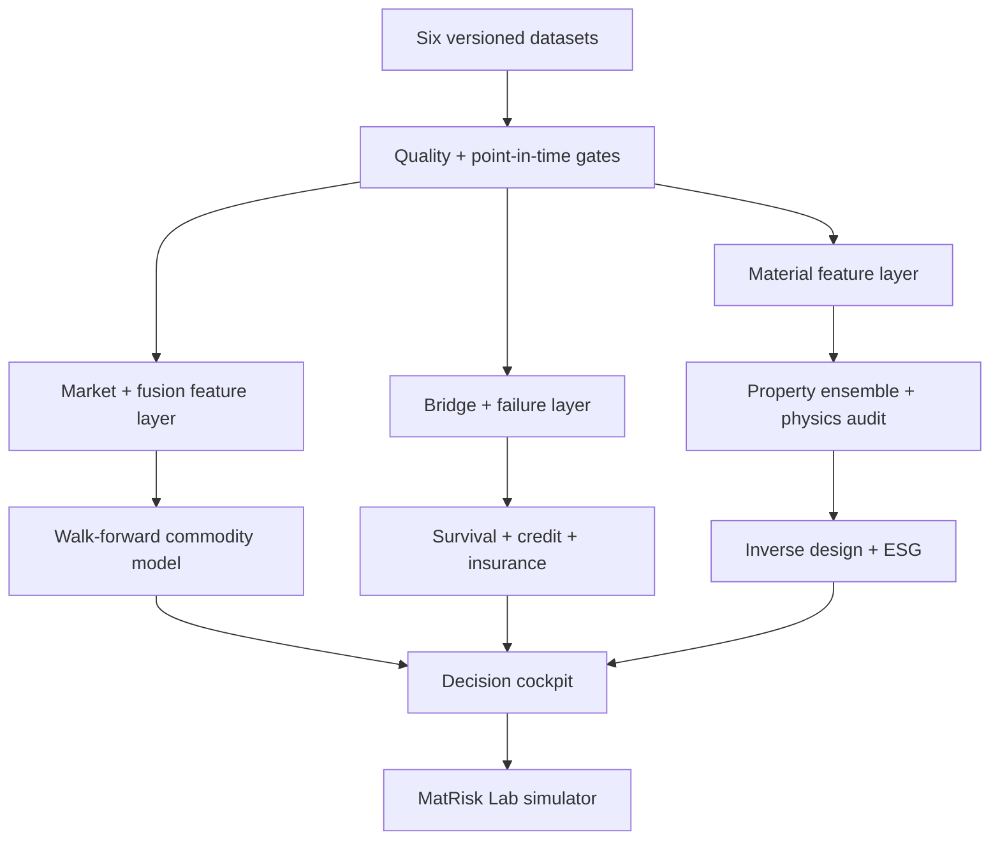

# MatRisk AI

**Physics-aware material intelligence for commodity, infrastructure, insurance, and ESG risk.**

MatRisk AI connects material properties to financial decisions through one auditable platform. It
uses the six supplied datasets (58,684 records) to power material exploration, commodity signals,
bridge survival and credit risk, insurance tail loss, cost-aware inverse design, ESG substitution,
and a two-level decision simulator.

> Status: complete, runnable assessment prototype. The supplied sample data supports defensible
> tabular baselines; production CGNN/WGAN training requires crystal structures and 100K+ external
> records. The repository makes that boundary explicit rather than presenting surrogate outputs as
> trained graph or generative models.

## What stands out

- **Leakage controls by design:** chemical-system group splits for materials and chronological
  point-in-time splits for markets.
- **Physics audit:** elastic-moduli consistency, positive moduli, Poisson bounds, and projection.
- **Financial translation:** survival → PD/LGD/EAD/EL, compound loss TVaR, five stress scenarios.
- **Decision cockpit:** five required analysis pages plus playable MatRisk Lab Campaign Levels 1–2.
- **Reproducibility:** configuration, quality report, tests, CI, Docker, API, and deterministic seeds.
- **Honest model governance:** proxy models are labelled; decision-support disclaimers are visible.

## Architecture



## Quick start

```bash
python -m venv .venv
source .venv/bin/activate          # Windows: .venv\Scripts\activate
pip install -e '.[dev]'
python scripts/run_quality.py
python scripts/train.py
streamlit run src/dashboard/app.py
```

API: `uvicorn src.api.main:app --reload`. Full services: `make docker`.

## Data contract

Place the supplied CSV files in `data/raw/`. Raw CSVs are intentionally git-ignored and represented
by DVC pointer files. DS2 and DS4 join one-to-one on `(date, commodity)`. Rolling warm-up nulls are
removed only after target construction; future observations never enter training features.

| Dataset | Rows | Role |
|---|---:|---|
| DS1 Material Properties | 5,500 | Property model, physics checks |
| DS2 Commodity Prices | 22,952 | Signals and walk-forward testing |
| DS3 Bridges | 5,000 | Survival, credit, stress |
| DS4 Cross-domain | 22,952 | MQI and fusion signals |
| DS5 Element Prices | 5,280 | Cost-aware inverse design |
| DS6 Failures | 2,000 | Insurance severity calibration |

## Model cards and evaluation

The material baseline is an Extra Trees multi-output ensemble split by chemical system. It reports
MAE/R² on a held-out family group and empirical uncertainty across trees. The commodity model uses
expanding walk-forward windows, a 21-day target, and 10 bps position-change costs. Evaluation commands
write metrics to `artifacts/`; metrics are not hard-coded into documentation.

The dataset does not include atomic coordinates required for a real crystal graph, nor compositions
as element-fraction vectors suitable for training a WGAN-GP. The inverse designer therefore performs
transparent constrained stochastic search and labels its property equations as screening surrogates.
This avoids the material misrepresentation explicitly prohibited by the project governance standard.

## Repository map

`src/data` loaders and quality gates · `src/features` leakage-safe features · `src/models` material,
physics, survival, and inverse design · `src/financial` commodity, credit, insurance, ESG, stress ·
`src/dashboard` Streamlit cockpit · `src/simulator` campaign engine · `src/api` FastAPI · `tests`
unit/integration coverage · `docs/technical_report.md` methodology and research record.

## Responsible use

This is an educational decision-support prototype, not investment advice, an engineering inspection,
a credit decision, or an insurance pricing system. Production deployment requires independent data
validation, model-risk review, monitored calibration, fairness analysis, and qualified human approval.

## Contributing

Create a feature branch, add tests, run `make lint test`, document data lineage, and never commit API
keys or raw licensed data. Conventional commits are recommended.

## Attribution

Created for the Zetheta Algorithms Private Limited MatRisk AI assessment. See `LICENSE`.

